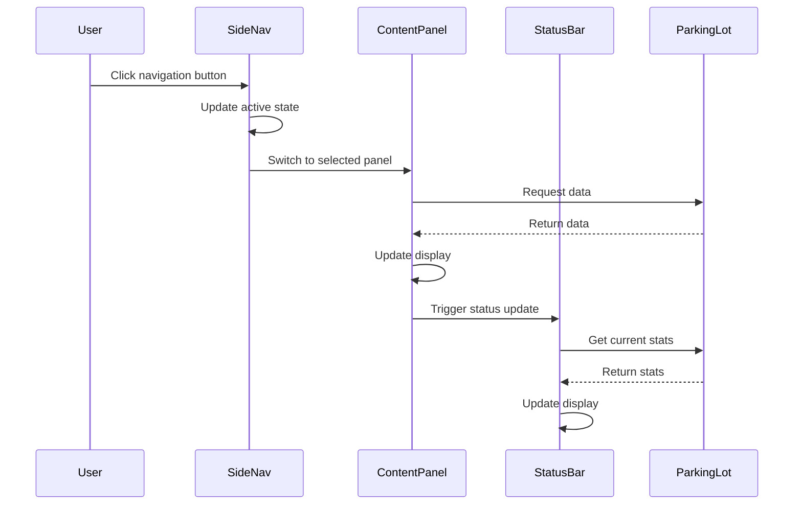

# Design Document: GUI Modernization

## Overview

This design document outlines the architecture and implementation approach for modernizing the University Parking Lot Management System's GUI. The modernization will transform the current basic Swing interface into a professional, visually appealing application using custom-styled components, a modern color scheme, and improved layout patterns.

The design follows a component-based approach where reusable styled components are created and composed to build the complete interface. A centralized theme management system ensures visual consistency across the application.

## Architecture

The GUI modernization follows a layered architecture:

```
┌─────────────────────────────────────────────────────────────┐
│                    MainFrame (Container)                     │
├─────────────────────────────────────────────────────────────┤
│  ┌──────────┐  ┌─────────────────────────────────────────┐  │
│  │          │  │              Header Panel               │  │
│  │          │  ├─────────────────────────────────────────┤  │
│  │   Side   │  │                                         │  │
│  │   Nav    │  │           Content Panel                 │  │
│  │  Panel   │  │    (Admin/Entry/Exit/Reports)           │  │
│  │          │  │                                         │  │
│  │          │  ├─────────────────────────────────────────┤  │
│  │          │  │              Status Bar                 │  │
│  └──────────┘  └─────────────────────────────────────────┘  │
└─────────────────────────────────────────────────────────────┘
```

### Component Hierarchy

```
ModernMainFrame
├── HeaderPanel
│   ├── LogoLabel
│   ├── TitleLabel
│   └── DateTimeLabel
├── SideNavigationPanel
│   ├── NavButton (Dashboard)
│   ├── NavButton (Vehicle Entry)
│   ├── NavButton (Vehicle Exit)
│   └── NavButton (Reports)
├── ContentPanel (CardLayout)
│   ├── ModernAdminPanel
│   │   ├── DashboardCard (Occupancy)
│   │   ├── DashboardCard (Revenue)
│   │   ├── DashboardCard (Available)
│   │   ├── DashboardCard (Parked)
│   │   ├── StyledTable (Floors)
│   │   └── StyledTable (Vehicles/Fines)
│   ├── ModernEntryPanel
│   ├── ModernExitPanel
│   └── ModernReportingPanel
└── StatusBarPanel
```

## Components and Interfaces

### Theme Management

```java
/**
 * Centralized theme configuration for the application.
 * Provides consistent colors, fonts, and dimensions.
 */
public class ThemeManager {
    // Primary Colors
    public static final Color PRIMARY = new Color(41, 128, 185);      // Blue
    public static final Color PRIMARY_DARK = new Color(31, 97, 141);  // Darker blue
    public static final Color PRIMARY_LIGHT = new Color(52, 152, 219); // Lighter blue
    
    // Accent Colors
    public static final Color SUCCESS = new Color(39, 174, 96);       // Green
    public static final Color WARNING = new Color(243, 156, 18);      // Orange
    public static final Color DANGER = new Color(231, 76, 60);        // Red
    public static final Color INFO = new Color(52, 152, 219);         // Light blue
    
    // Background Colors
    public static final Color BG_DARK = new Color(44, 62, 80);        // Dark sidebar
    public static final Color BG_LIGHT = new Color(236, 240, 241);    // Light content
    public static final Color BG_WHITE = new Color(255, 255, 255);    // White panels
    public static final Color BG_CARD = new Color(248, 249, 250);     // Card background
    
    // Text Colors
    public static final Color TEXT_PRIMARY = new Color(44, 62, 80);   // Dark text
    public static final Color TEXT_SECONDARY = new Color(127, 140, 141); // Gray text
    public static final Color TEXT_LIGHT = new Color(255, 255, 255);  // White text
    
    // Fonts
    public static final Font FONT_TITLE = new Font("Segoe UI", Font.BOLD, 24);
    public static final Font FONT_HEADER = new Font("Segoe UI", Font.BOLD, 18);
    public static final Font FONT_SUBHEADER = new Font("Segoe UI", Font.BOLD, 14);
    public static final Font FONT_BODY = new Font("Segoe UI", Font.PLAIN, 13);
    public static final Font FONT_SMALL = new Font("Segoe UI", Font.PLAIN, 11);
    
    // Dimensions
    public static final int SIDEBAR_WIDTH = 220;
    public static final int HEADER_HEIGHT = 60;
    public static final int STATUS_BAR_HEIGHT = 30;
    public static final int CARD_PADDING = 15;
    public static final int BORDER_RADIUS = 8;
}
```

### Custom Styled Components

#### StyledButton

```java
/**
 * Custom button with hover effects and modern styling.
 */
public class StyledButton extends JButton {
    private Color normalColor;
    private Color hoverColor;
    private Color pressedColor;
    private int borderRadius;
    
    public StyledButton(String text, Color color);
    public void setRounded(boolean rounded);
    protected void paintComponent(Graphics g);
}
```

#### StyledTextField

```java
/**
 * Custom text field with rounded borders and focus effects.
 */
public class StyledTextField extends JTextField {
    private Color borderColor;
    private Color focusBorderColor;
    private int borderRadius;
    
    public StyledTextField(int columns);
    protected void paintComponent(Graphics g);
    protected void paintBorder(Graphics g);
}
```

#### DashboardCard

```java
/**
 * Card component for displaying statistics with icon and value.
 */
public class DashboardCard extends JPanel {
    private String title;
    private String value;
    private Color accentColor;
    private Icon icon;
    
    public DashboardCard(String title, String value, Color accentColor);
    public void setValue(String value);
    public void setIcon(Icon icon);
    protected void paintComponent(Graphics g);
}
```

#### StyledTable

```java
/**
 * Enhanced table with alternating row colors and hover effects.
 */
public class StyledTable extends JTable {
    private Color evenRowColor;
    private Color oddRowColor;
    private Color hoverColor;
    private Color headerColor;
    
    public StyledTable(DefaultTableModel model);
    public Component prepareRenderer(TableCellRenderer renderer, int row, int column);
}
```

### Panel Components

#### HeaderPanel

```java
/**
 * Application header with logo, title, and date/time display.
 */
public class HeaderPanel extends JPanel {
    private JLabel logoLabel;
    private JLabel titleLabel;
    private JLabel dateTimeLabel;
    private Timer dateTimeTimer;
    
    public HeaderPanel();
    private void updateDateTime();
}
```

#### SideNavigationPanel

```java
/**
 * Sidebar navigation with styled buttons and active state tracking.
 */
public class SideNavigationPanel extends JPanel {
    private List<NavButton> navButtons;
    private NavButton activeButton;
    private ActionListener navigationListener;
    
    public SideNavigationPanel(ActionListener listener);
    public void setActiveButton(int index);
    private NavButton createNavButton(String text, String iconPath);
}
```

#### StatusBarPanel

```java
/**
 * Status bar showing real-time system information.
 */
public class StatusBarPanel extends JPanel {
    private JLabel connectionStatus;
    private JLabel vehicleCount;
    private JLabel occupancyRate;
    private Timer updateTimer;
    
    public StatusBarPanel(ParkingLot parkingLot);
    public void updateStatus();
}
```

### Dialog Components

#### StyledDialog

```java
/**
 * Custom styled dialog for messages and confirmations.
 */
public class StyledDialog extends JDialog {
    public enum DialogType { SUCCESS, ERROR, WARNING, INFO }
    
    public static void showSuccess(Component parent, String message);
    public static void showError(Component parent, String message);
    public static void showWarning(Component parent, String message);
    public static boolean showConfirm(Component parent, String message);
}
```

## Data Models

No new data models are required for the GUI modernization. The existing models (ParkingLot, Vehicle, ParkingSpot, Fine, etc.) will continue to be used. The GUI components will simply present this data in a more visually appealing manner.

## Component Interaction Flow




## Correctness Properties

*A property is a characteristic or behavior that should hold true across all valid executions of a system—essentially, a formal statement about what the system should do. Properties serve as the bridge between human-readable specifications and machine-verifiable correctness guarantees.*

Based on the prework analysis, the following correctness properties have been identified:

### Property 1: Theme Color Definition Completeness

*For any* ThemeManager class, it SHALL define non-null Color constants for all required categories: PRIMARY, PRIMARY_DARK, PRIMARY_LIGHT, SUCCESS, WARNING, DANGER, INFO, BG_DARK, BG_LIGHT, BG_WHITE, BG_CARD, TEXT_PRIMARY, TEXT_SECONDARY, and TEXT_LIGHT.

**Validates: Requirements 1.1**

### Property 2: Navigation Button Active State

*For any* SideNavigationPanel with multiple navigation buttons, when a button is clicked, that button's background color SHALL change to indicate active state, and all other buttons SHALL have the inactive background color.

**Validates: Requirements 2.3**

### Property 3: Dashboard Card Structure

*For any* DashboardCard instance, it SHALL contain a non-empty title label, a value label, and have a background color distinct from the default panel background.

**Validates: Requirements 3.1, 3.2**

### Property 4: Dashboard Card Value Updates

*For any* DashboardCard and any valid string value, calling setValue() SHALL update the displayed value text to match the provided string.

**Validates: Requirements 3.3**

### Property 5: Styled Text Field Appearance

*For any* StyledTextField instance, it SHALL have a border radius greater than 0 and insets (padding) greater than the default JTextField insets.

**Validates: Requirements 4.1**

### Property 6: Table Alternating Row Colors

*For any* StyledTable with at least 2 rows, the background color of even-indexed rows SHALL differ from the background color of odd-indexed rows.

**Validates: Requirements 5.1**

### Property 7: Table Header Styling

*For any* StyledTable, the table header background color SHALL differ from the row background colors, and the header font SHALL be bold.

**Validates: Requirements 5.2**

### Property 8: Table Row Height Adequacy

*For any* StyledTable, the row height SHALL be at least 25 pixels to ensure readability.

**Validates: Requirements 5.4**

### Property 9: Header Background Distinction

*For any* HeaderPanel and its parent container, the header background color SHALL differ from the main content panel background color.

**Validates: Requirements 6.2**

### Property 10: Status Bar Data Accuracy

*For any* StatusBarPanel connected to a ParkingLot, the displayed vehicle count SHALL equal the actual number of parked vehicles, and the displayed occupancy percentage SHALL equal the calculated occupancy rate (within 0.1% tolerance).

**Validates: Requirements 7.2, 7.3**

### Property 11: Status Bar Real-Time Updates

*For any* StatusBarPanel, when the underlying ParkingLot state changes (vehicle enters or exits), calling updateStatus() SHALL reflect the new state in the displayed values.

**Validates: Requirements 7.4**

### Property 12: Responsive Layout Behavior

*For any* ModernMainFrame, when the frame size is changed, the content panel width SHALL change proportionally (within 10% of the expected ratio).

**Validates: Requirements 8.1, 8.3**

### Property 13: Dialog Color By Type

*For any* StyledDialog of type SUCCESS, the accent color SHALL be ThemeManager.SUCCESS (green). *For any* StyledDialog of type ERROR, the accent color SHALL be ThemeManager.DANGER (red).

**Validates: Requirements 9.1, 9.2**

### Property 14: Ticket Display Background Distinction

*For any* ticket display panel, its background color SHALL differ from its parent panel's background color.

**Validates: Requirements 10.3**

## Error Handling

### Component Initialization Errors

- If ThemeManager colors fail to load, fall back to default Swing colors
- If custom fonts are unavailable, use system default fonts
- Log initialization errors but don't crash the application

### Layout Errors

- If component sizing fails, use minimum sizes as fallback
- Handle null layout managers gracefully

### Timer Errors

- If status bar timer fails, display "Update unavailable" message
- If date/time timer fails, show static timestamp

### Resource Loading Errors

- If icons fail to load, display text-only buttons
- Use placeholder icons when resources are missing

## Testing Strategy

### Unit Tests

Unit tests will verify specific component behaviors:

1. **ThemeManager Tests**: Verify all color constants are defined and non-null
2. **StyledButton Tests**: Verify color changes on hover/press states
3. **StyledTextField Tests**: Verify border radius and padding values
4. **DashboardCard Tests**: Verify title, value, and icon display
5. **StyledTable Tests**: Verify row colors and header styling

### Property-Based Tests

Property-based tests will use jqwik to verify universal properties:

1. **Theme completeness**: All required colors exist
2. **Navigation state**: Only one button active at a time
3. **Card updates**: setValue always updates display
4. **Table styling**: Alternating colors always differ
5. **Status accuracy**: Displayed values match actual data

### Integration Tests

1. **Full GUI initialization**: Verify all panels load correctly
2. **Navigation flow**: Verify panel switching works
3. **Data refresh**: Verify status bar updates with parking lot changes

### Test Configuration

- Property-based tests: Minimum 100 iterations per property
- Use jqwik framework for property-based testing
- Tag format: **Feature: gui-modernization, Property {number}: {property_text}**
