# University Parking Lot Management System - UML Diagrams

## Table of Contents
1. [Class Diagram](#class-diagram)
2. [Sequence Diagrams](#sequence-diagrams)
3. [State Diagram](#state-diagram)
4. [Use Case Diagram](#use-case-diagram)
5. [Architecture Overview](#architecture-overview)

---

## Class Diagram

### Core Domain Model

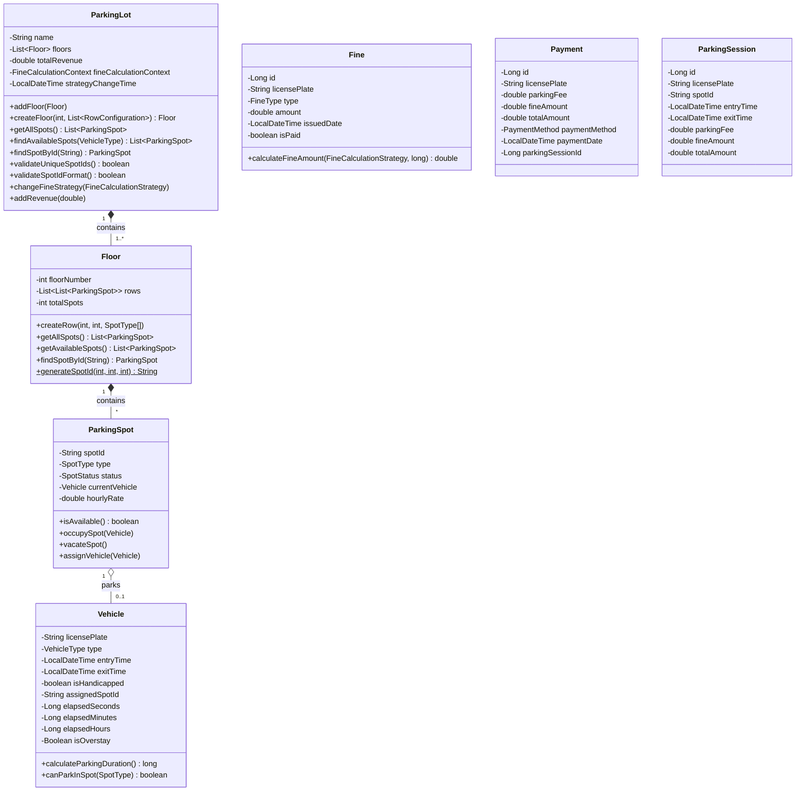

### Enumerations

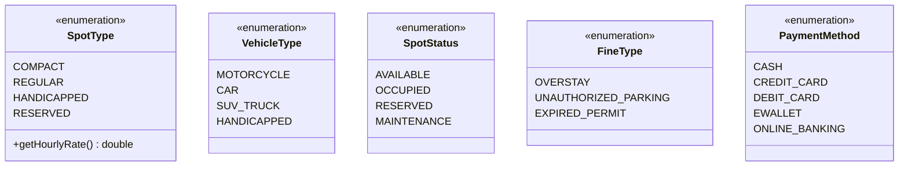

### Strategy Pattern - Fine Calculation

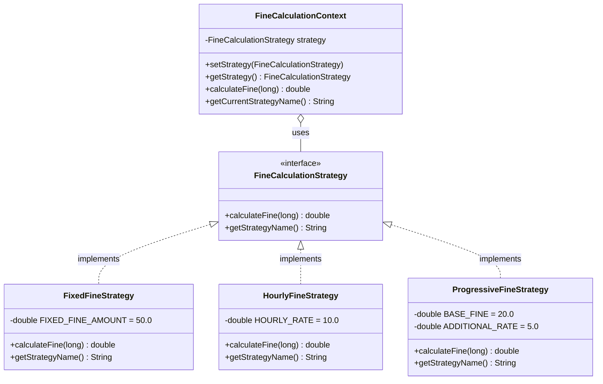

### DAO Layer

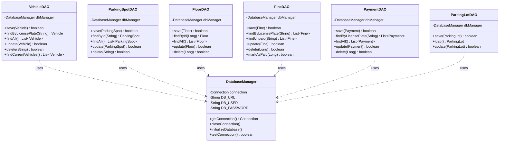

### Controller Layer

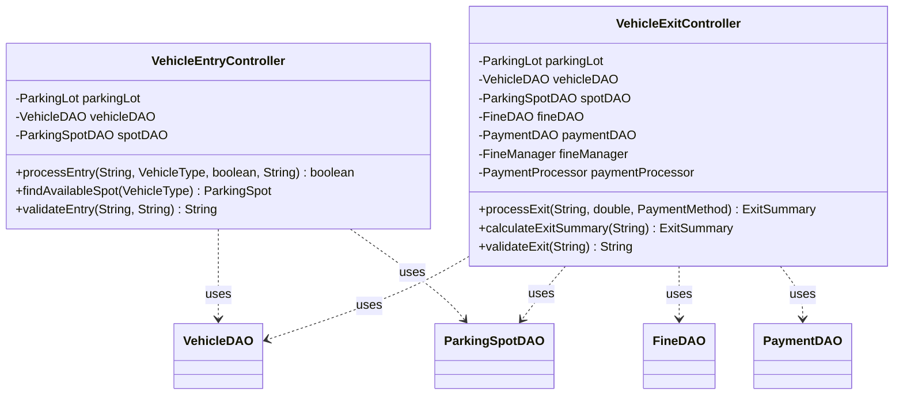

### Utility Layer

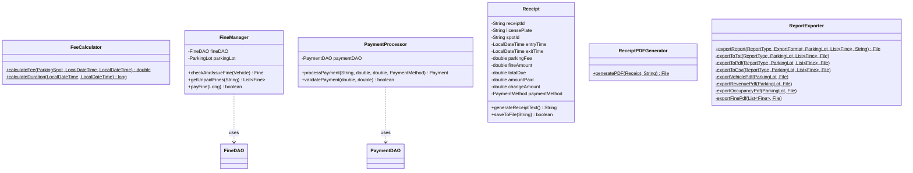

### View Layer - Main Frames

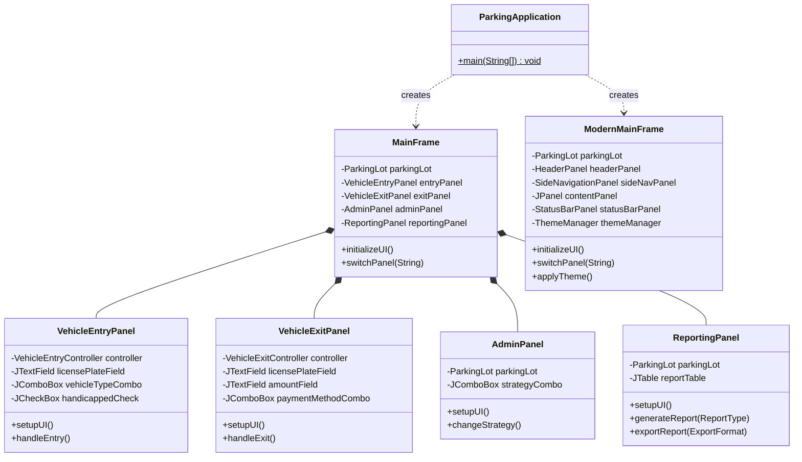

### View Layer - UI Components

```mermaid
classDiagram
    class BasePanel {
        #ParkingLot parkingLot
        #setupUI()*
        #refreshData()*
    }
    
    class HeaderPanel {
        -JLabel titleLabel
        -JLabel userLabel
        +updateUser(String)
    }
    
    class SideNavigationPanel {
        -List~JButton~ buttons
        -JButton activeButton
        +setActive(JButton)
        +addButton(String, ActionListener) JButton
    }
    
    class StatusBarPanel {
        -JLabel statusLabel
        +updateStatus(String)
    }
    
    class DashboardCard {
        -String title
        -String value
        -Icon icon
        +updateValue(String)
        +setIcon(Icon)
    }
    
    class StyledButton {
        -boolean isPrimary
        -boolean isSecondary
        +applyStyle()
    }
    
    class StyledTextField {
        -String placeholder
        +setPlaceholder(String)
        +getText() String
    }
    
    class StyledComboBox {
        -List items
        +addItem(Object)
        +getSelected() Object
    }
    
    class StyledTable {
        -TableModel model
        -String[] columns
        +setData(Object[][])
        +refresh()
    }
    
    class StyledDialog {
        -String title
        -String message
        +show()
        +showError(String)$
        +showSuccess(String)$
    }
    
    class ThemeManager {
        -String currentTheme
        -Map~String,Color~ colors
        +applyTheme(String)
        +getColor(String) Color
        +setTheme(String)
    }
    
    class InputValidator {
        +validateLicensePlate(String)$ boolean
        +validateAmount(String)$ boolean
        +validateSpotId(String)$ boolean
    }
    
    class EventHandler {
        +onClick()
        +onChange()
        +onSubmit()
    }
    
    VehicleEntryPanel --|> BasePanel
    VehicleExitPanel --|> BasePanel
    AdminPanel --|> BasePanel
    ReportingPanel --|> BasePanel
```

---

## Sequence Diagrams

### 1. Vehicle Entry Process

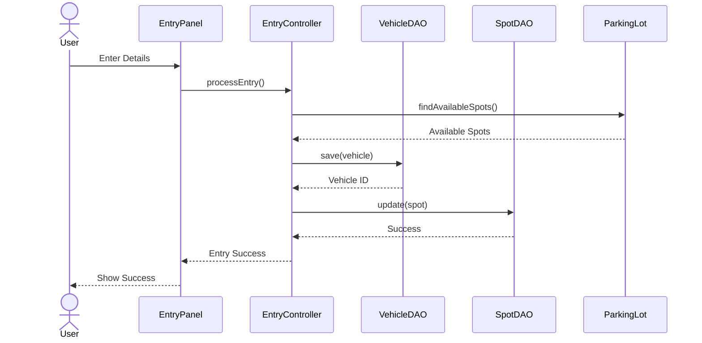

### 2. Vehicle Exit Process

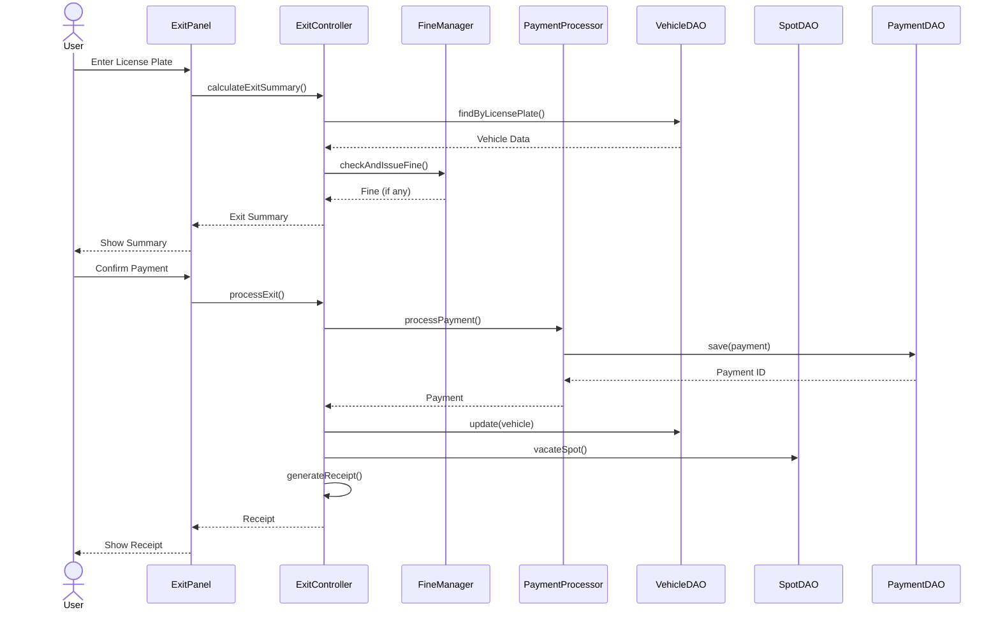

### 3. Fine Calculation Strategy Change

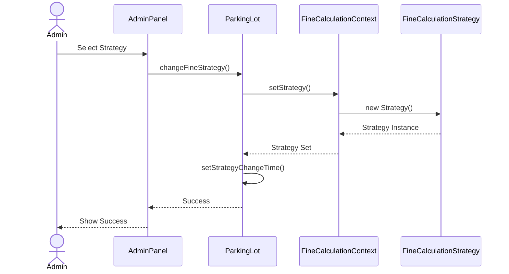

### 4. Report Generation and Export

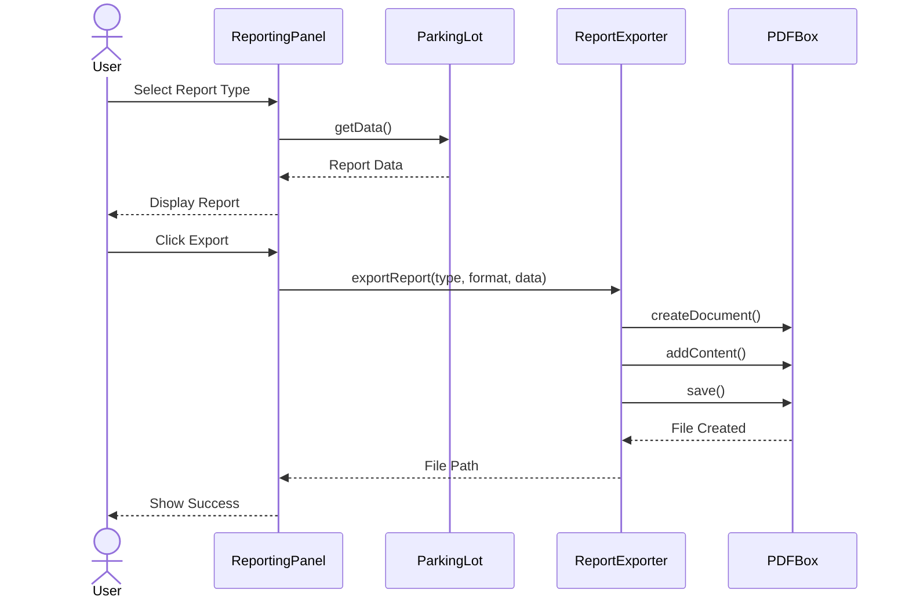

---

## State Diagrams

### Parking Spot State Diagram

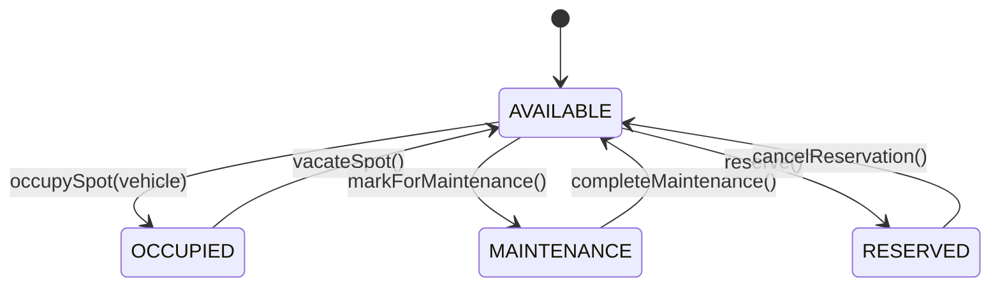

### Vehicle Parking Session State Diagram

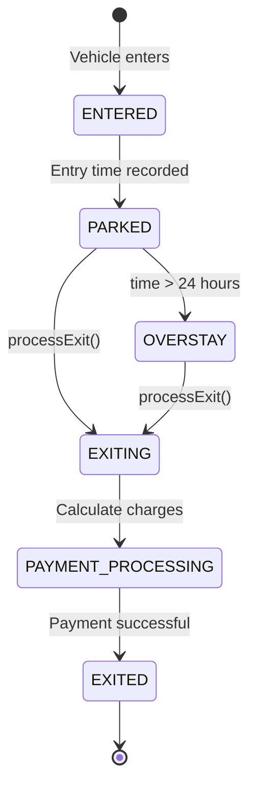

### Fine State Diagram

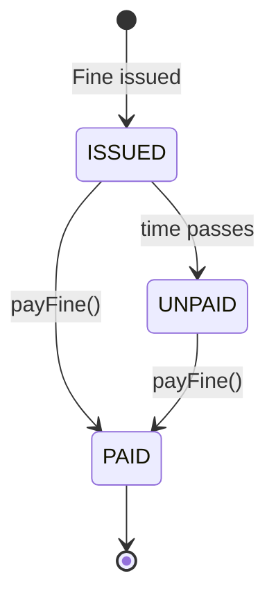

---

## Use Case Diagram

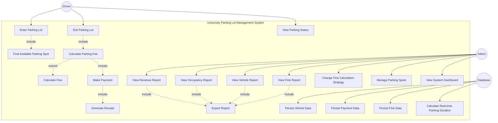

---

## Architecture Overview

### Layered Architecture

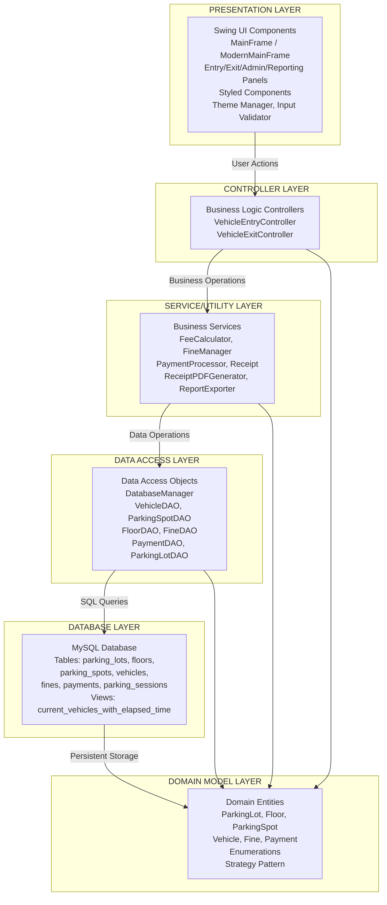

### Database Schema

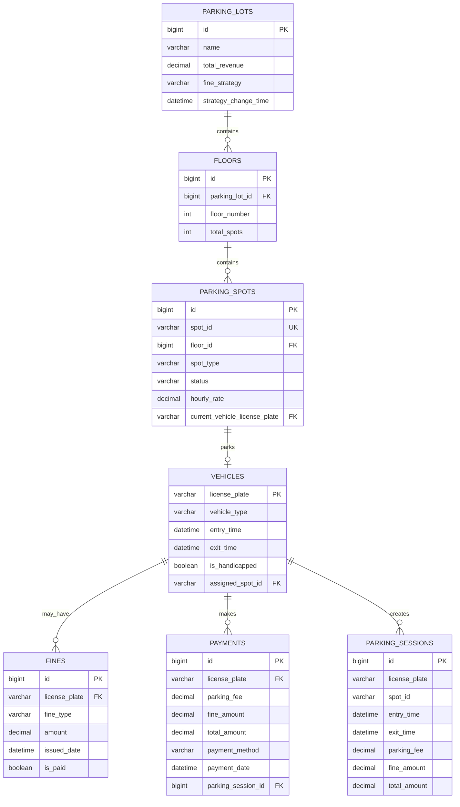

---

## Design Patterns

### Strategy Pattern Implementation

```mermaid
graph TB
    subgraph Strategy Pattern
        Context[FineCalculationContext]
        Interface[FineCalculationStrategy Interface]
        Fixed[FixedFineStrategy<br/>50 RM flat]
        Hourly[HourlyFineStrategy<br/>10 RM per hour]
        Progressive[ProgressiveFineStrategy<br/>20 RM base + 5 RM per hour]
        
        Context -->|uses| Interface
        Interface <|..|implements| Fixed
        Interface <|..|implements| Hourly
        Interface <|..|implements| Progressive
    end
    
    ParkingLot -->|contains| Context
    Admin -->|changes strategy| ParkingLot
```

---

## Summary

This UML documentation provides a comprehensive view of the University Parking Lot Management System using Mermaid diagrams:

- **Class Diagrams**: Detailed class structures across all layers (Model, DAO, Controller, Utility, View)
- **Package Diagram**: Organization of classes into logical packages
- **Sequence Diagrams**: Key workflows (Vehicle Entry, Exit, Fine Strategy Change, Report Export)
- **State Diagrams**: State transitions for Parking Spots, Vehicles, and Fines
- **Use Case Diagram**: Actor interactions and system functionality
- **Architecture Overview**: Layered architecture and design patterns
- **Database Schema**: Entity relationship diagram

The system follows a clean layered architecture with clear separation of concerns:
- **Presentation Layer**: Swing UI components
- **Controller Layer**: Business logic
- **Service Layer**: Utility services
- **DAO Layer**: Data access
- **Database Layer**: MySQL persistence
- **Domain Model**: Core business entities

Key design patterns implemented:
- Strategy Pattern for fine calculations
- DAO Pattern for data access
- MVC Pattern for application structure
- Singleton for database management
