# University Parking Lot Management System - UML Diagrams

## Table of Contents
1. [Class Diagram](#class-diagram)
2. [Sequence Diagrams](#sequence-diagrams)
3. [State Diagram](#state-diagram)
4. [Use Case Diagram](#use-case-diagram)
5. [Architecture Overview](#architecture-overview)

---

## Class Diagram

### Core Domain Model

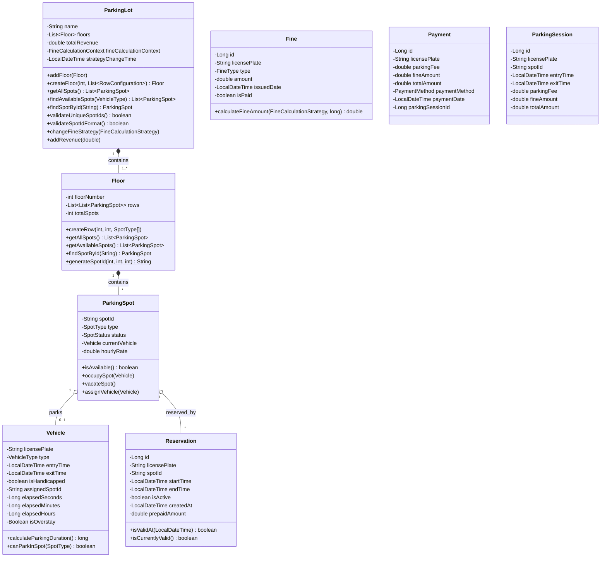

### Enumerations

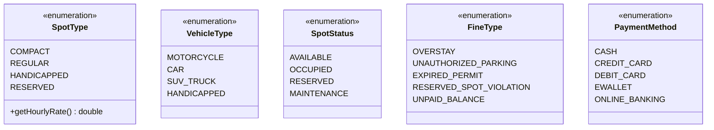

### Strategy Pattern - Fine Calculation

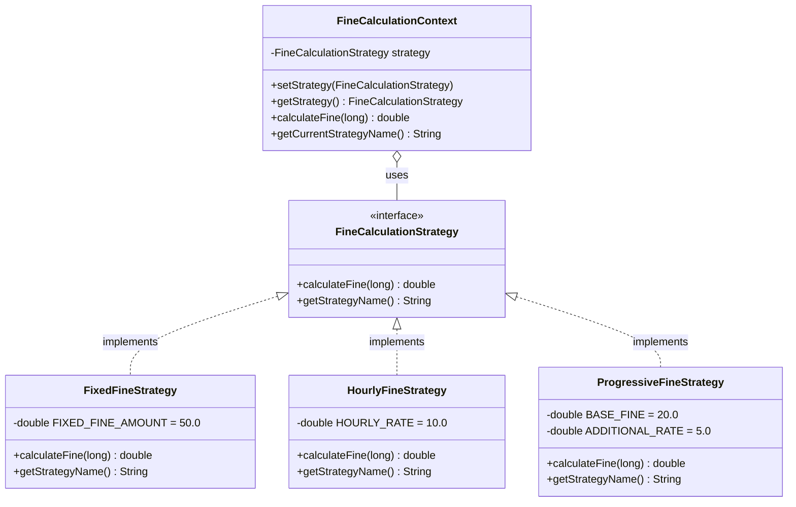

### DAO Layer

```mermaid
classDiagram
    class DatabaseManager {
        -Connection connection
        -String DB_URL
        -String DB_USER
        -String DB_PASSWORD
        +getConnection() Connection
        +closeConnection()
        +initializeDatabase()
        +testConnection() boolean
    }
    
    class VehicleDAO {
        -DatabaseManager dbManager
        +save(Vehicle) boolean
        +findByLicensePlate(String) Vehicle
        +findAll() List~Vehicle~
        +update(Vehicle) boolean
        +delete(String) boolean
        +findCurrentVehicles() List~Vehicle~
    }
    
    class ParkingSpotDAO {
        -DatabaseManager dbManager
        +save(ParkingSpot) boolean
        +findById(String) ParkingSpot
        +findAll() List~ParkingSpot~
        +update(ParkingSpot) boolean
        +delete(String) boolean
    }
    
    class FloorDAO {
        -DatabaseManager dbManager
        +save(Floor) boolean
        +findById(Long) Floor
        +findAll() List~Floor~
        +update(Floor) boolean
        +delete(Long) boolean
    }
    
    class FineDAO {
        -DatabaseManager dbManager
        +save(Fine) boolean
        +findByLicensePlate(String) List~Fine~
        +findUnpaid(String) List~Fine~
        +update(Fine) boolean
        +delete(Long) boolean
        +markAsPaid(Long) boolean
    }
    
    class PaymentDAO {
        -DatabaseManager dbManager
        +save(Payment) boolean
        +findByLicensePlate(String) List~Payment~
        +findAll() List~Payment~
        +update(Payment) boolean
        +delete(Long) boolean
    }
    
    class ParkingLotDAO {
        -DatabaseManager dbManager
        +save(ParkingLot) boolean
        +load() ParkingLot
        +update(ParkingLot) boolean
    }
    
    class ReservationDAO {
        -DatabaseManager dbManager
        +save(Reservation) boolean
        +findValidReservation(String, String, LocalDateTime) Reservation
        +findByLicensePlate(String) List~Reservation~
        +findBySpotId(String) List~Reservation~
        +isSpotReserved(String, LocalDateTime, LocalDateTime) boolean
        +cancel(Long) boolean
        +findAll() List~Reservation~
    }
    
    VehicleDAO ..> DatabaseManager : uses
    ParkingSpotDAO ..> DatabaseManager : uses
    FloorDAO ..> DatabaseManager : uses
    FineDAO ..> DatabaseManager : uses
    PaymentDAO ..> DatabaseManager : uses
    ParkingLotDAO ..> DatabaseManager : uses
    ReservationDAO ..> DatabaseManager : uses
```

### Controller Layer

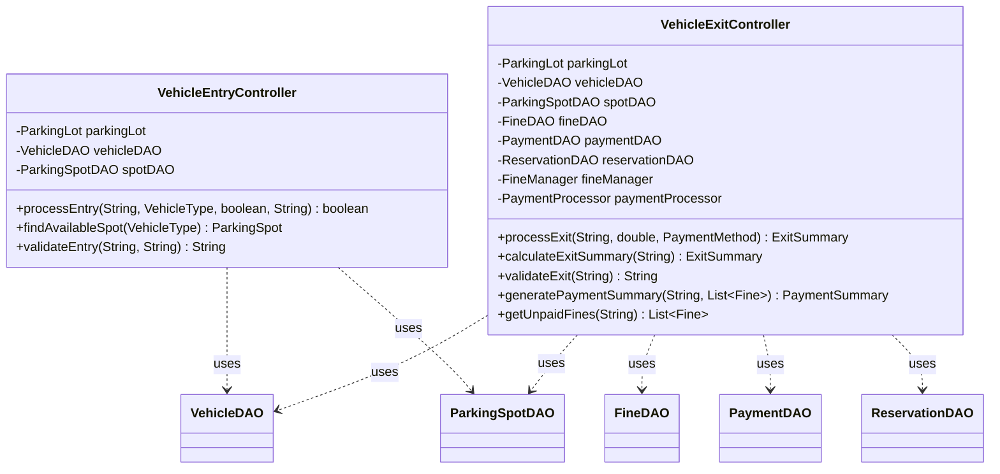

### Utility Layer

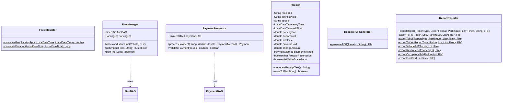

### View Layer - Main Frames

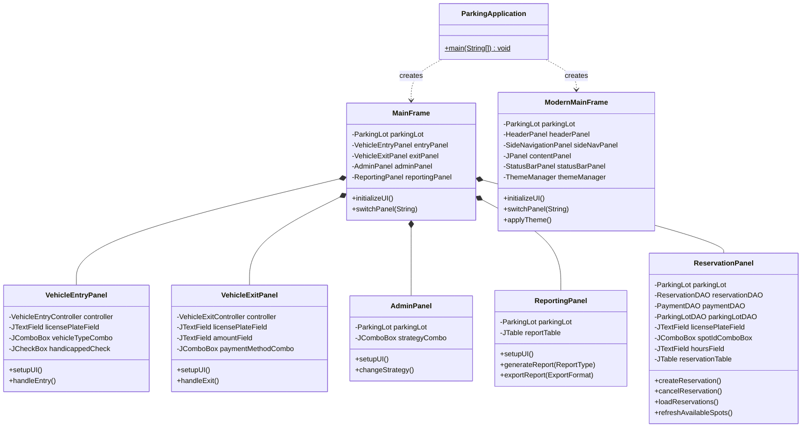

### View Layer - UI Components


---

## Sequence Diagrams

### 1. Vehicle Entry Process

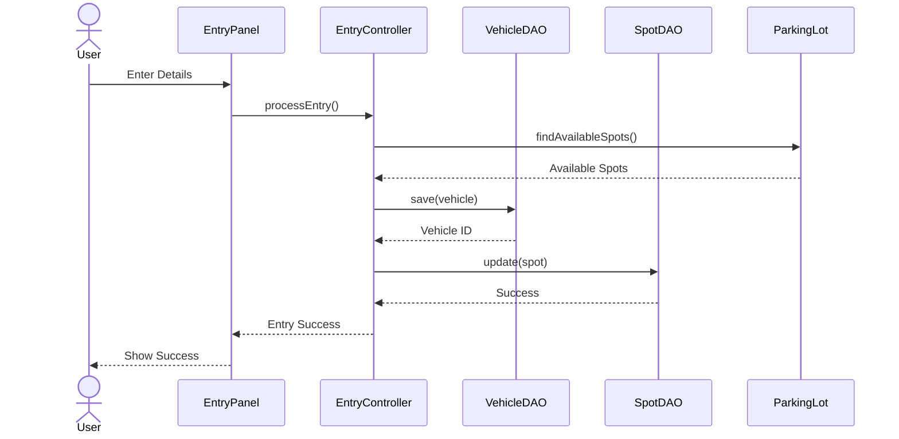

### 2. Vehicle Exit Process

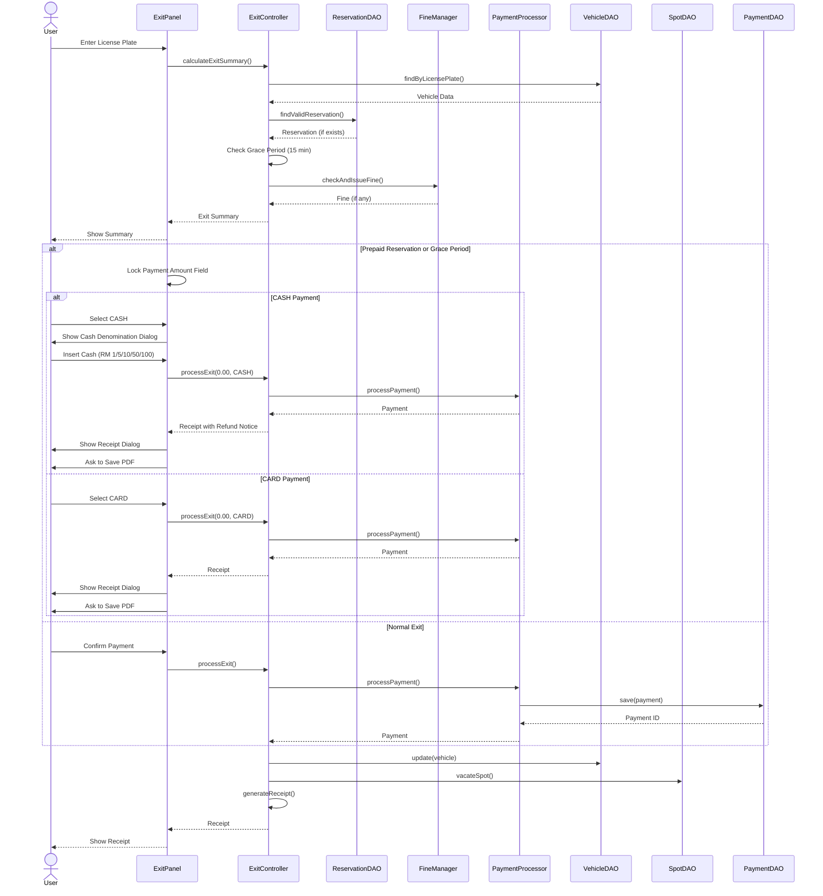

### 3. Reservation Creation Process

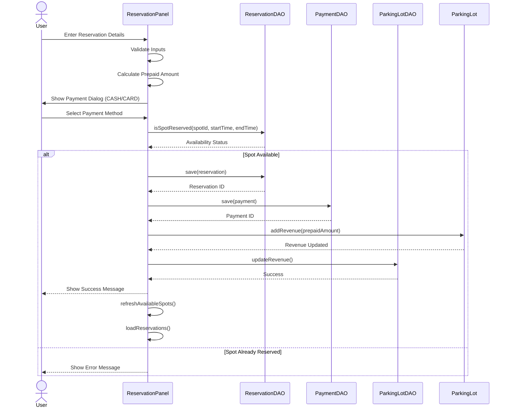

### 4. Fine Calculation Strategy Change

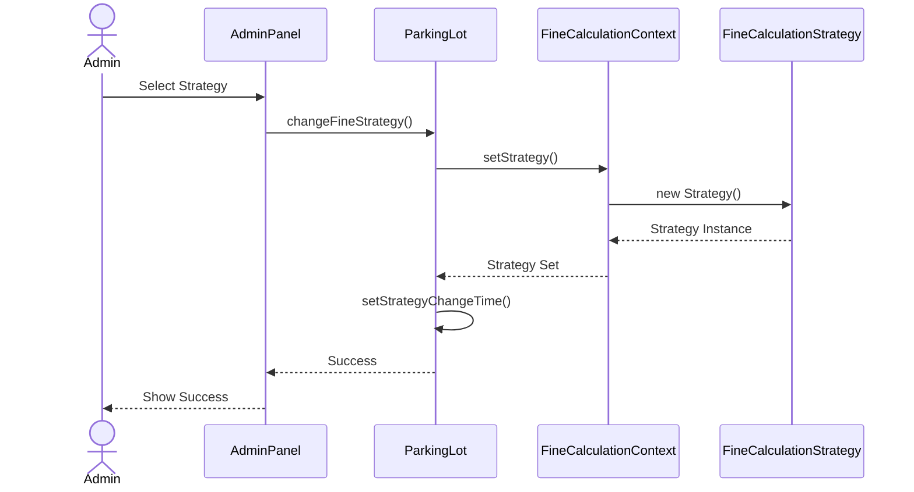

### 5. Report Generation and Export

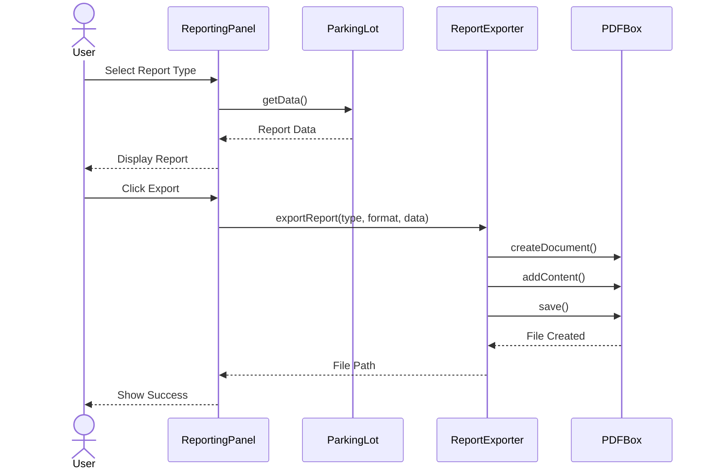

### 6. Reserved Spot Violation Fine

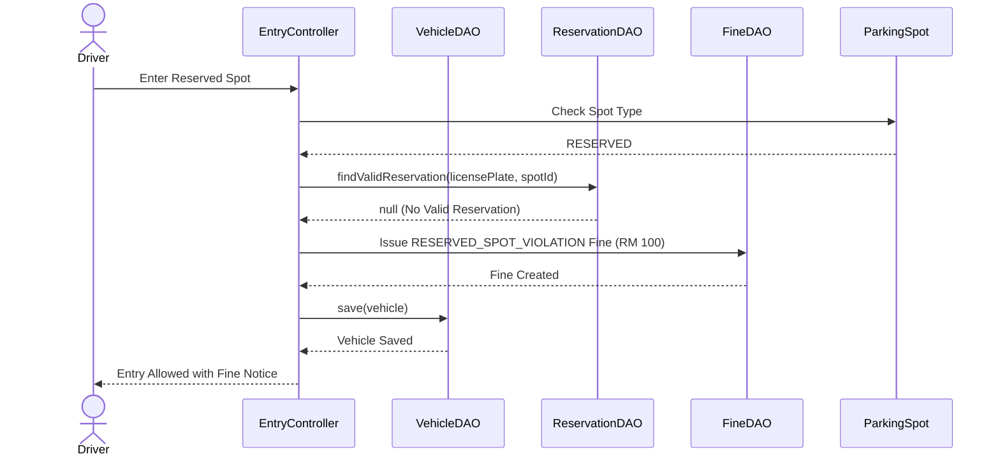

### 7. Grace Period Exit (15-Minute U-Turn)

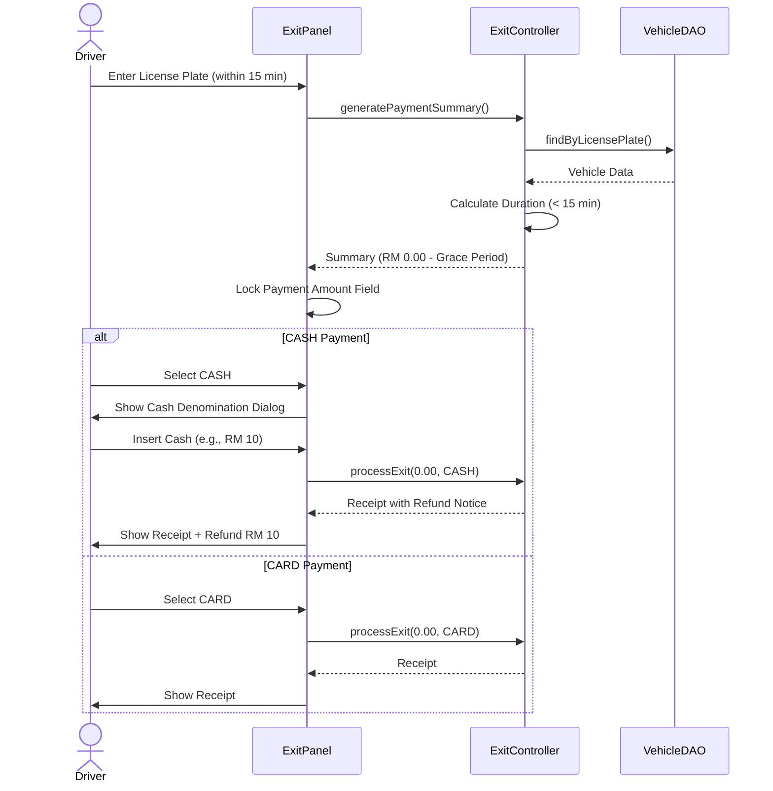

---

## State Diagrams

### Parking Spot State Diagram

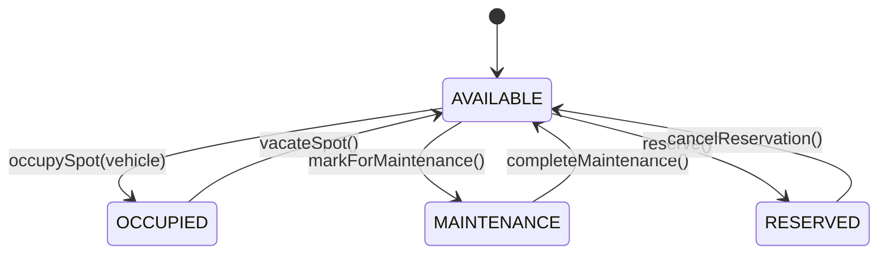

### Vehicle Parking Session State Diagram

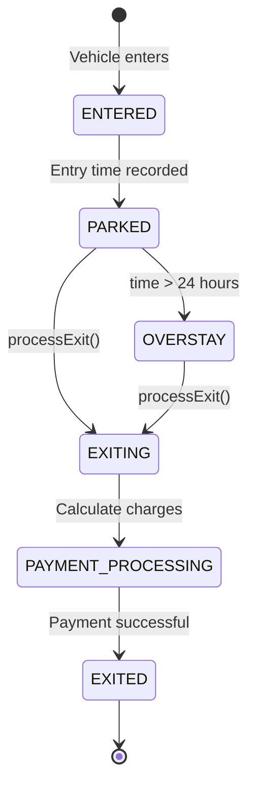

### Fine State Diagram

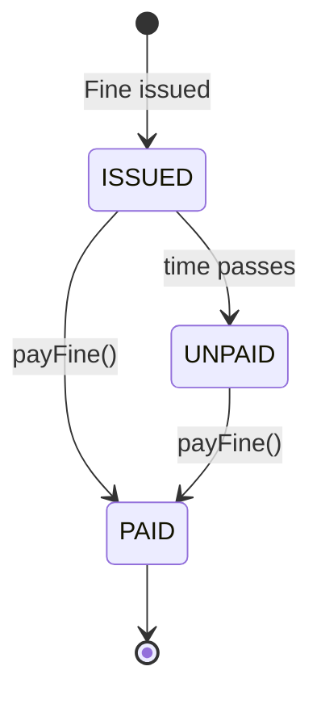

---

## Use Case Diagram

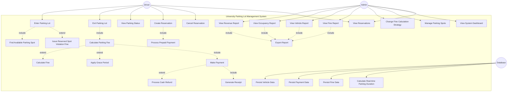

---

## Architecture Overview

### Layered Architecture

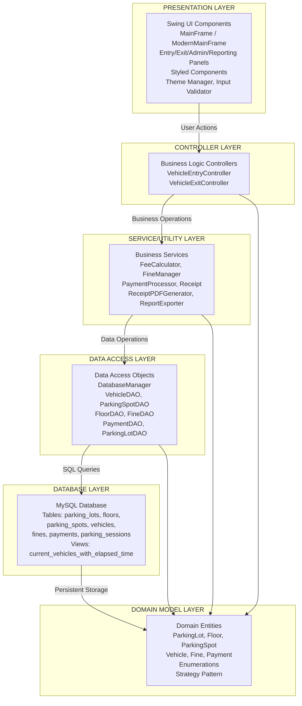

### Database Schema

```mermaid
erDiagram
    PARKING_LOTS ||--o{ FLOORS : contains
    FLOORS ||--o{ PARKING_SPOTS : contains
    PARKING_SPOTS ||--o| VEHICLES : parks
    PARKING_SPOTS ||--o{ RESERVATIONS : reserved_by
    VEHICLES ||--o{ FINES : may_have
    VEHICLES ||--o{ PAYMENTS : makes
    VEHICLES ||--o{ PARKING_SESSIONS : creates
    
    PARKING_LOTS {
        bigint id PK
        varchar name
        decimal total_revenue
        varchar fine_strategy
        datetime strategy_change_time
    }
    
    FLOORS {
        bigint id PK
        bigint parking_lot_id FK
        int floor_number
        int total_spots
    }
    
    PARKING_SPOTS {
        bigint id PK
        varchar spot_id UK
        bigint floor_id FK
        varchar spot_type
        varchar status
        decimal hourly_rate
        varchar current_vehicle_license_plate FK
    }
    
    VEHICLES {
        varchar license_plate PK
        varchar vehicle_type
        datetime entry_time
        datetime exit_time
        boolean is_handicapped
        varchar assigned_spot_id FK
    }
    
    FINES {
        bigint id PK
        varchar license_plate FK
        varchar fine_type
        decimal amount
        datetime issued_date
        boolean is_paid
    }
    
    PAYMENTS {
        bigint id PK
        varchar license_plate FK
        decimal parking_fee
        decimal fine_amount
        decimal total_amount
        varchar payment_method
        datetime payment_date
        bigint parking_session_id FK
    }
    
    PARKING_SESSIONS {
        bigint id PK
        varchar license_plate
        varchar spot_id
        datetime entry_time
        datetime exit_time
        decimal parking_fee
        decimal fine_amount
        decimal total_amount
    }
    
    RESERVATIONS {
        bigint id PK
        varchar license_plate
        varchar spot_id FK
        datetime start_time
        datetime end_time
        boolean is_active
        datetime created_at
        decimal prepaid_amount
    }
```

---

## Design Patterns

### Strategy Pattern Implementation

```mermaid
graph TB
    subgraph Strategy Pattern
        Context[FineCalculationContext]
        Interface[FineCalculationStrategy Interface]
        Fixed[FixedFineStrategy<br/>50 RM flat]
        Hourly[HourlyFineStrategy<br/>10 RM per hour]
        Progressive[ProgressiveFineStrategy<br/>20 RM base + 5 RM per hour]
        
        Context -->|uses| Interface
        Interface <|..|implements| Fixed
        Interface <|..|implements| Hourly
        Interface <|..|implements| Progressive
    end
    
    ParkingLot -->|contains| Context
    Admin -->|changes strategy| ParkingLot
```

---

## Summary

This UML documentation provides a comprehensive view of the University Parking Lot Management System using Mermaid diagrams:

- **Class Diagrams**: Detailed class structures across all layers (Model, DAO, Controller, Utility, View)
- **Package Diagram**: Organization of classes into logical packages
- **Sequence Diagrams**: Key workflows (Vehicle Entry, Exit, Fine Strategy Change, Report Export)
- **State Diagrams**: State transitions for Parking Spots, Vehicles, and Fines
- **Use Case Diagram**: Actor interactions and system functionality
- **Architecture Overview**: Layered architecture and design patterns
- **Database Schema**: Entity relationship diagram

The system follows a clean layered architecture with clear separation of concerns:
- **Presentation Layer**: Swing UI components
- **Controller Layer**: Business logic
- **Service Layer**: Utility services
- **DAO Layer**: Data access
- **Database Layer**: MySQL persistence
- **Domain Model**: Core business entities

Key design patterns implemented:
- Strategy Pattern for fine calculations
- DAO Pattern for data access
- MVC Pattern for application structure
- Singleton for database management


---

## New Features Summary

### 1. Reservation System
- **Prepaid Reservations**: Customers pay upfront for reserved spots (RM 10/hour)
- **Multiple Entry/Exit**: Within reservation period, vehicles can enter/exit multiple times without additional charges
- **Reservation Management**: Create, view, and cancel reservations
- **No Refund Policy**: Cancelled reservations do not receive refunds
- **Database Persistence**: Reservations stored in `reservations` table

### 2. Grace Period (15-Minute U-Turn)
- **Zero Charge Exit**: Vehicles exiting within 15 minutes pay RM 0.00 parking fee
- **Applies To**:
  - All non-RESERVED spots
  - RESERVED spots WITHOUT valid reservation (wrong plate number)
- **After Grace Period**: Minimum 1-hour parking fee applies
- **Payment Handling**:
  - CASH: Must insert cash (RM 1/5/10/50/100), then full refund
  - CARD: No amount needed, can exit with RM 0.00

### 3. Reserved Spot Violation Fine
- **New Fine Type**: `RESERVED_SPOT_VIOLATION`
- **Amount**: RM 100 fixed fine
- **Triggered When**: Non-reserved vehicle enters a RESERVED spot
- **Grace Period Interaction**:
  - Exit within 15 min: RM 100 fine only (no parking fee)
  - Exit after 15 min: RM 100 fine + RM 10 parking fee = RM 110

### 4. Prepaid Reservation Exit
- **Zero Payment**: Vehicles with valid reservations pay RM 0.00 at exit
- **Payment Method Handling**:
  - CASH: Shows denomination dialog, inserts cash, receives full refund
  - CARD: No amount needed, exits immediately
- **Receipt Generation**: Shows "PREPAID RESERVATION" status on receipt
- **UI Enhancement**: Payment amount field is locked (disabled) for prepaid exits

### 5. Cash Refund System
- **Denomination Selection**: RM 1, 5, 10, 50, 100
- **Refund Scenarios**:
  - Grace period exits with CASH payment
  - Prepaid reservation exits with CASH payment
- **Receipt Display**: Shows cash inserted and refund amount
- **PDF Generation**: Option to save receipt with refund details

### 6. UI Enhancements
- **Payment Amount Field Locking**: Automatically locks for grace period and prepaid reservation exits
- **Receipt Dialog**: Shows receipt in dialog before asking to save PDF
- **Cash Denomination Dialog**: User-friendly selection for cash payments
- **Status Indicators**: Clear display of "PREPAID", "15-MIN GRACE", or normal payment status

### 7. Fine Types
- **OVERSTAY**: Vehicle parked > 24 hours (strategy-based calculation)
- **UNAUTHORIZED_PARKING**: General unauthorized parking
- **EXPIRED_PERMIT**: Parking with expired permit
- **RESERVED_SPOT_VIOLATION**: Non-reserved vehicle in RESERVED spot (RM 100)
- **UNPAID_BALANCE**: Remaining balance from partial payment

### 8. Reservation Behavior
- **If Vehicle Never Enters**: Reservation remains valid, prepaid amount already collected, spot remains available for other vehicles
- **Expiration**: After end time, reservation status shows "EXPIRED" but remains in database for record-keeping
- **No Entry Required**: System does not require vehicle to physically enter to maintain reservation validity
