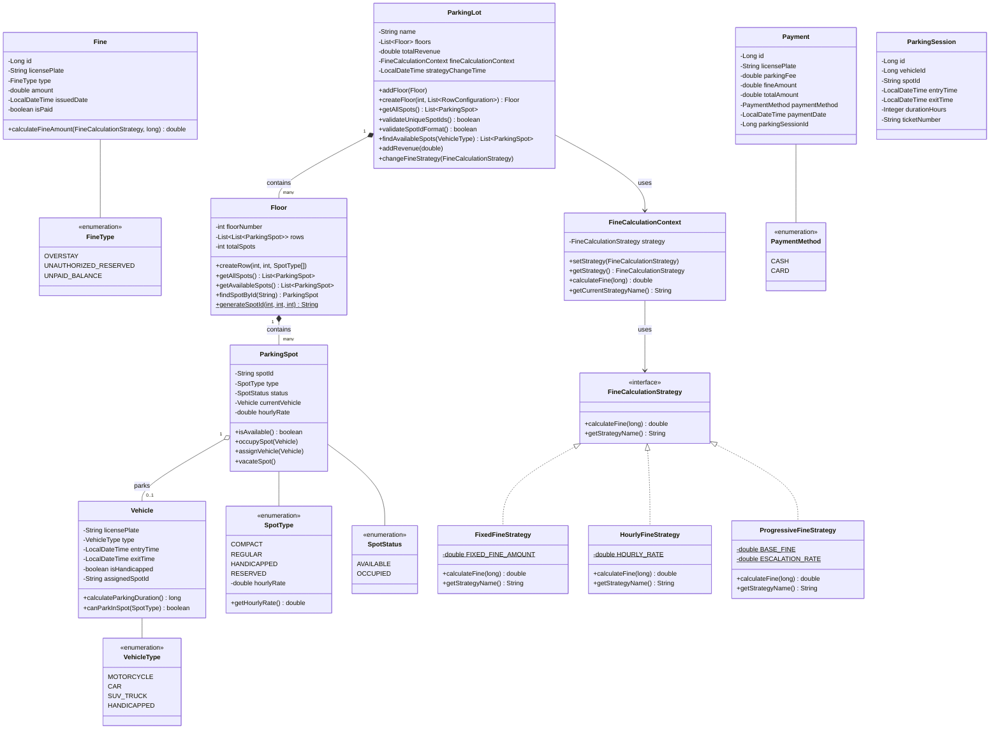
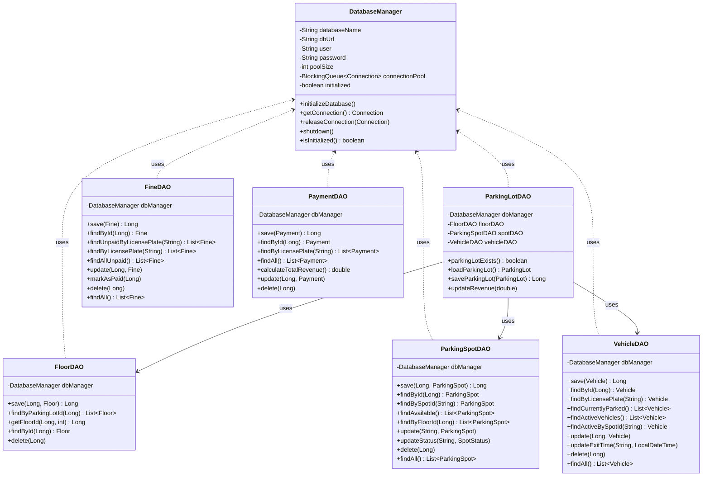
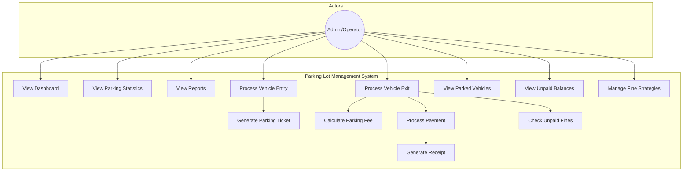
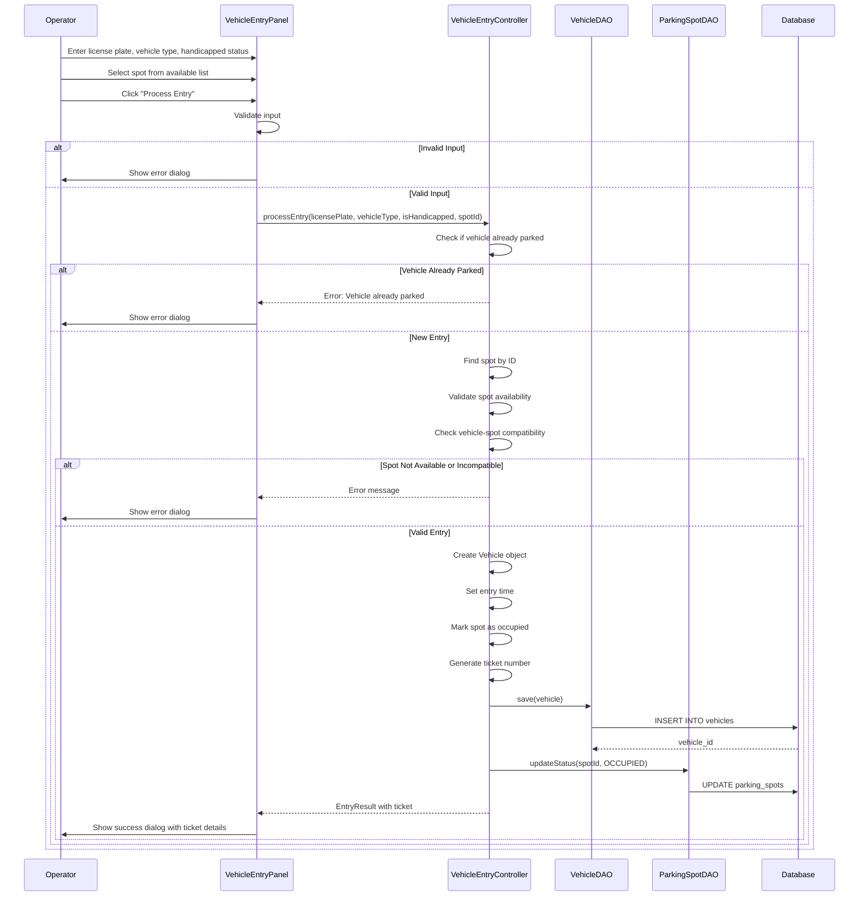
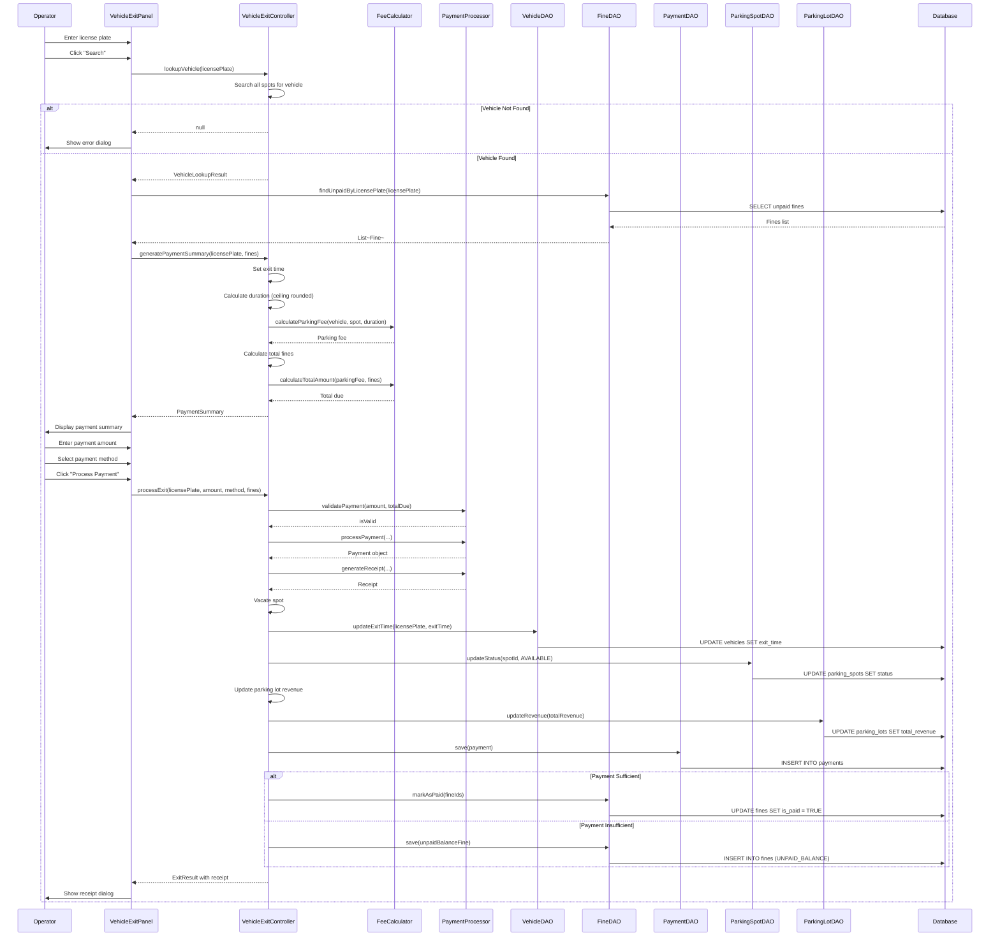
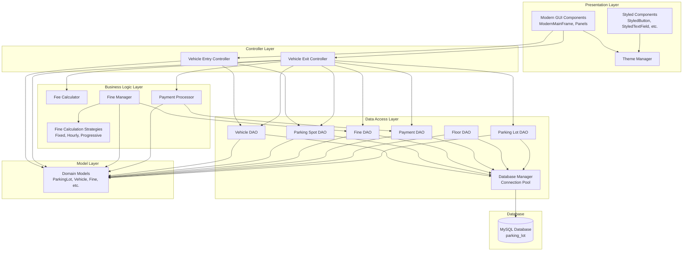
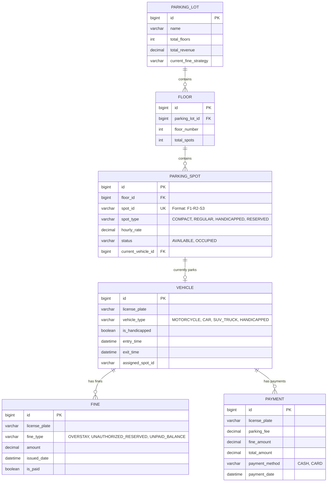

# UML Diagrams - Parking Lot Management System

This document contains UML diagrams representing the actual system architecture using Mermaid syntax.

## Table of Contents
1. [Class Diagram - Model Layer](#1-class-diagram---model-layer)
2. [Class Diagram - DAO Layer](#2-class-diagram---dao-layer)
3. [Class Diagram - View Layer](#3-class-diagram---view-layer)
4. [Class Diagram - Controller & Utility](#4-class-diagram---controller--utility)
5. [Use Case Diagram](#5-use-case-diagram)
6. [Sequence Diagram - Vehicle Entry](#6-sequence-diagram---vehicle-entry)
7. [Sequence Diagram - Vehicle Exit & Payment](#7-sequence-diagram---vehicle-exit--payment)
8. [Component Diagram](#8-component-diagram)
9. [Package Diagram](#9-package-diagram)
10. [Entity Relationship Diagram](#10-entity-relationship-diagram-database)

---

## 1. Class Diagram - Model Layer

---

## 2. Class Diagram - DAO Layer

---

## 3. Class Diagram - View Layer

```mermaid
classDiagram
    class ThemeManager {
        <<utility>>
        +Color PRIMARY$
        +Color PRIMARY_DARK$
        +Color PRIMARY_LIGHT$
        +Color SUCCESS$
        +Color WARNING$
        +Color DANGER$
        +Color INFO$
        +Color BG_DARK$
        +Color BG_LIGHT$
        +Color BG_WHITE$
        +Color BG_CARD$
        +Color TEXT_PRIMARY$
        +Color TEXT_SECONDARY$
        +Color TEXT_LIGHT$
        +Font FONT_TITLE$
        +Font FONT_HEADER$
        +Font FONT_SUBHEADER$
        +Font FONT_BODY$
        +Font FONT_SMALL$
        +int SIDEBAR_WIDTH$
        +int HEADER_HEIGHT$
        +int STATUS_BAR_HEIGHT$
        +int CARD_PADDING$
        +int BORDER_RADIUS$
    }

    class ModernMainFrame {
        -HeaderPanel headerPanel
        -SideNavigationPanel sideNavPanel
        -JPanel contentPanel
        -CardLayout cardLayout
        -StatusBarPanel statusBarPanel
        -AdminPanel adminPanel
        -VehicleEntryPanel entryPanel
        -VehicleExitPanel exitPanel
        -ReportingPanel reportingPanel
        -ParkingLot parkingLot
        -DatabaseManager dbManager
        -FineDAO fineDAO
        +showPanel(String)
        +refreshAllPanels()
        +cleanup()
    }

    class HeaderPanel {
        -JLabel logoLabel
        -JLabel titleLabel
        -JLabel dateTimeLabel
        -Timer dateTimeTimer
        -updateDateTime()
        +stopTimer()
        +getHeaderBackground() Color
    }

    class SideNavigationPanel {
        -List~NavButton~ navButtons
        -NavButton activeButton
        -ActionListener navigationListener
        +setActiveButton(int)
        +setActiveButton(String)
        +getActiveButton() NavButton
    }

    class NavButton {
        -String text
        -String icon
        -boolean active
        -boolean hovered
        +setActive(boolean)
        +isActive() boolean
        +getCurrentBackgroundColor() Color
    }

    class StatusBarPanel {
        -ParkingLot parkingLot
        -JLabel connectionStatusLabel
        -JLabel vehicleCountLabel
        -JLabel occupancyRateLabel
        -Timer updateTimer
        -boolean connected
        +updateStatus()
        +setConnected()
        +setDisconnected()
        +getDisplayedVehicleCount() int
        +getDisplayedOccupancyRate() double
        +stopTimer()
    }

    class BasePanel {
        <<abstract>>
        #ParkingLot parkingLot
        +refreshData()*
        #createButton(String) StyledButton
        #createTextField(int) StyledTextField
        #createStyledTable() StyledTable
        #showError(String)
        #showSuccess(String)
        #showInfo(String)
        #showConfirm(String) boolean
        #validateNotEmpty(JTextField, String) boolean
        #validateLicensePlate(String) boolean
    }

    class AdminPanel {
        -DatabaseManager dbManager
        -FineDAO fineDAO
        +refreshData()
    }

    class VehicleEntryPanel {
        -DatabaseManager dbManager
        -FineDAO fineDAO
        +refreshData()
    }

    class VehicleExitPanel {
        -DatabaseManager dbManager
        -FineDAO fineDAO
        +refreshData()
    }

    class ReportingPanel {
        -DatabaseManager dbManager
        -FineDAO fineDAO
        +refreshData()
    }

    class StyledButton {
        -Color normalColor
        -Color hoverColor
        -Color pressedColor
        -Color textColor
        -int borderRadius
        -boolean isHovered
        -boolean isPressed
        +setBorderRadius(int)
        +setNormalColor(Color)
        +setTextColor(Color)
        #paintComponent(Graphics)
    }

    class StyledTextField {
        -Color borderColor
        -Color focusBorderColor
        -int borderRadius
        -boolean hasFocus
        +setBorderRadius(int)
        +setBorderColor(Color)
        +setFocusBorderColor(Color)
        #paintComponent(Graphics)
        #paintBorder(Graphics)
    }

    class StyledTable {
        -Color evenRowColor
        -Color oddRowColor
        -Color hoverColor
        -Color headerColor
        -int hoveredRow
        +setEvenRowColor(Color)
        +setOddRowColor(Color)
        +setHoverColor(Color)
        +prepareRenderer() Component
    }

    class StyledComboBox~E~ {
        +StyledComboBox()
        +StyledComboBox(E[])
        +StyledComboBox(ComboBoxModel~E~)
    }

    class DashboardCard {
        -String title
        -String value
        -Color accentColor
        -Icon icon
        -JLabel titleLabel
        -JLabel valueLabel
        -JLabel iconLabel
        +setValue(String)
        +setIcon(Icon)
        +setTitle(String)
        +setAccentColor(Color)
        #paintComponent(Graphics)
    }

    class StyledDialog {
        <<enumeration>> DialogType
        -DialogType dialogType
        -Color accentColor
        -boolean confirmed
        +showSuccess(Component, String)$
        +showError(Component, String)$
        +showWarning(Component, String)$
        +showInfo(Component, String)$
        +showConfirm(Component, String)$ boolean
        +getAccentColor() Color
        +isConfirmed() boolean
    }

    ModernMainFrame *-- HeaderPanel
    ModernMainFrame *-- SideNavigationPanel
    ModernMainFrame *-- StatusBarPanel
    ModernMainFrame *-- AdminPanel
    ModernMainFrame *-- VehicleEntryPanel
    ModernMainFrame *-- VehicleExitPanel
    ModernMainFrame *-- ReportingPanel

    SideNavigationPanel *-- NavButton

    BasePanel <|-- AdminPanel
    BasePanel <|-- VehicleEntryPanel
    BasePanel <|-- VehicleExitPanel
    BasePanel <|-- ReportingPanel

    BasePanel ..> StyledButton : creates
    BasePanel ..> StyledTextField : creates
    BasePanel ..> StyledTable : creates
    BasePanel ..> StyledDialog : uses

    AdminPanel ..> DashboardCard : uses
    AdminPanel ..> StyledTable : uses

    ThemeManager <.. ModernMainFrame : uses
    ThemeManager <.. StyledButton : uses
    ThemeManager <.. StyledTextField : uses
    ThemeManager <.. StyledTable : uses
    ThemeManager <.. DashboardCard : uses
    ThemeManager <.. HeaderPanel : uses
    ThemeManager <.. StatusBarPanel : uses
```

---

## 4. Class Diagram - Controller & Utility

```mermaid
classDiagram
    class VehicleEntryController {
        -ParkingLot parkingLot
        -DatabaseManager dbManager
        -VehicleDAO vehicleDAO
        -ParkingSpotDAO spotDAO
        +findAvailableSpots(VehicleType) List~ParkingSpot~
        +findAvailableSpotsForVehicle(Vehicle) List~ParkingSpot~
        +processEntry(String, VehicleType, boolean, String) EntryResult
        +generateTicket(String, LocalDateTime) String
    }

    class EntryResult {
        -Vehicle vehicle
        -ParkingSpot spot
        -ParkingSession session
        -String ticketNumber
        +getTicketDisplay() String
    }

    class VehicleExitController {
        -ParkingLot parkingLot
        -DatabaseManager dbManager
        -FineDAO fineDAO
        -PaymentDAO paymentDAO
        -ParkingSpotDAO spotDAO
        -VehicleDAO vehicleDAO
        -ParkingLotDAO parkingLotDAO
        -List~Fine~ unpaidFines
        +lookupVehicle(String) VehicleLookupResult
        +generatePaymentSummary(String, List~Fine~) PaymentSummary
        +processExit(String, double, PaymentMethod, List~Fine~) ExitResult
        +getUnpaidFines(String) List~Fine~
        +addUnpaidFine(Fine)
    }

    class VehicleLookupResult {
        -Vehicle vehicle
        -ParkingSpot spot
    }

    class PaymentSummary {
        -Vehicle vehicle
        -ParkingSpot spot
        -long durationHours
        -double parkingFee
        -List~Fine~ unpaidFines
        -double totalFines
        -double totalDue
        +getDisplayText() String
    }

    class ExitResult {
        -PaymentSummary summary
        -Payment payment
        -Receipt receipt
        -boolean paymentSufficient
        -double remainingBalance
    }

    class FeeCalculator {
        <<utility>>
        +calculateParkingFee(Vehicle, ParkingSpot, long)$ double
        +calculateTotalAmount(double, double)$ double
    }

    class FineManager {
        -FineDAO fineDAO
        +checkAndGenerateOverstayFine(Vehicle, FineCalculationStrategy) Fine
        +checkAndGenerateUnauthorizedReservedFine(String, SpotType, boolean, FineCalculationStrategy) Fine
        +generateFines(Vehicle, SpotType, boolean, FineCalculationStrategy) List~Fine~
        +saveFine(Fine) Long
        +getUnpaidFines(String) List~Fine~
        +markFinesAsPaid(List~Long~)
        +calculateTotalUnpaidFines(String) double
    }

    class PaymentProcessor {
        <<utility>>
        +validatePayment(double, double)$ boolean
        +calculateRemainingBalance(double, double)$ double
        +processPayment(String, double, double, double, PaymentMethod)$ Payment
        +generateReceipt(...)$ Receipt
        +isValidPaymentMethod(PaymentMethod)$ boolean
    }

    class Receipt {
        -String licensePlate
        -LocalDateTime entryTime
        -LocalDateTime exitTime
        -long durationHours
        -double parkingFee
        -double fineAmount
        -double totalAmount
        -double amountPaid
        -double remainingBalance
        -PaymentMethod paymentMethod
        -LocalDateTime paymentDate
        -String spotId
        +generateReceiptText() String
    }

    VehicleEntryController --> VehicleDAO
    VehicleEntryController --> ParkingSpotDAO
    VehicleEntryController ..> EntryResult : creates

    VehicleExitController --> VehicleDAO
    VehicleExitController --> FineDAO
    VehicleExitController --> PaymentDAO
    VehicleExitController --> ParkingSpotDAO
    VehicleExitController --> ParkingLotDAO
    VehicleExitController ..> VehicleLookupResult : creates
    VehicleExitController ..> PaymentSummary : creates
    VehicleExitController ..> ExitResult : creates
    VehicleExitController --> FeeCalculator : uses
    VehicleExitController --> PaymentProcessor : uses

    FineManager --> FineDAO
    PaymentProcessor ..> Receipt : creates

    ExitResult --> PaymentSummary
    ExitResult --> Payment
    ExitResult --> Receipt
```

---

## 5. Use Case Diagram

---

## 6. Sequence Diagram - Vehicle Entry

---

## 7. Sequence Diagram - Vehicle Exit & Payment

---

## 8. Component Diagram

---

## 9. Package Diagram

```mermaid
flowchart TB
    subgraph "com.university.parking"
        Main[ParkingApplication<br/>Main Entry Point]
        
        subgraph model["model"]
            M1[ParkingLot, Floor, ParkingSpot]
            M2[Vehicle, Fine, Payment]
            M3[ParkingSession]
            M4[Enums: VehicleType, SpotType,<br/>SpotStatus, FineType, PaymentMethod]
            M5[Strategy Pattern:<br/>FineCalculationStrategy,<br/>FixedFineStrategy,<br/>HourlyFineStrategy,<br/>ProgressiveFineStrategy,<br/>FineCalculationContext]
        end
        
        subgraph view["view"]
            V1[ModernMainFrame]
            V2[Panels: AdminPanel, VehicleEntryPanel,<br/>VehicleExitPanel, ReportingPanel]
            V3[Layout: HeaderPanel, SideNavigationPanel,<br/>StatusBarPanel]
            V4[Styled Components: StyledButton,<br/>StyledTextField, StyledTable,<br/>StyledComboBox, StyledDialog,<br/>DashboardCard]
            V5[ThemeManager]
            V6[BasePanel]
        end
        
        subgraph controller["controller"]
            C1[VehicleEntryController]
            C2[VehicleExitController]
            C3[Inner Classes: EntryResult,<br/>VehicleLookupResult,<br/>PaymentSummary, ExitResult]
        end
        
        subgraph dao["dao"]
            D1[DatabaseManager]
            D2[ParkingLotDAO, FloorDAO,<br/>ParkingSpotDAO]
            D3[VehicleDAO, FineDAO,<br/>PaymentDAO]
        end
        
        subgraph util["util"]
            U1[FeeCalculator]
            U2[FineManager]
            U3[PaymentProcessor]
            U4[Receipt]
        end
    end

    Main --> view
    view --> controller
    view --> model
    controller --> dao
    controller --> util
    controller --> model
    util --> dao
    util --> model
    dao --> model
```

---

## 10. Entity Relationship Diagram (Database)

---

## Notes

### Key Design Patterns

1. **Strategy Pattern**: Used for fine calculation with three strategies (Fixed, Hourly, Progressive)
2. **DAO Pattern**: Separates data access logic from business logic
3. **MVC Architecture**: Clear separation between Model, View, and Controller layers
4. **Singleton-like**: ThemeManager uses static constants for centralized theme management
5. **Factory-like**: BasePanel provides factory methods for creating styled components

### Important Relationships

- **ParkingLot** contains multiple **Floors**, each containing multiple **ParkingSpots**
- **ParkingSpot** can have at most one **Vehicle** parked (0..1 relationship)
- **Vehicle** is identified by license plate and can have multiple **Fines** and **Payments**
- **Fines** persist across parking sessions (linked to license plate, not parking session)
- **DatabaseManager** uses connection pooling for efficient database access
- All styled components use **ThemeManager** for consistent appearance

### Database Design

- Uses MySQL with InnoDB engine for transaction support
- Spot IDs follow format: `F{floor}-R{row}-S{spot}` (e.g., "F1-R2-S3")
- Fines are linked to license plates (not vehicle IDs) to persist across sessions
- Connection pooling implemented with `BlockingQueue<Connection>`
- Database name: `parking_lot` (configurable for testing)

### GUI Architecture

- **ModernMainFrame** uses BorderLayout with CardLayout for content switching
- **SideNavigationPanel** contains **NavButton** instances for navigation
- **BasePanel** provides common functionality for all content panels
- All styled components extend Swing components with custom painting
- Theme colors and fonts centralized in **ThemeManager**

### View these diagrams

- GitHub: Automatically renders Mermaid diagrams
- VS Code: Install "Markdown Preview Mermaid Support" extension
- Other tools: Any Markdown viewer with Mermaid support
